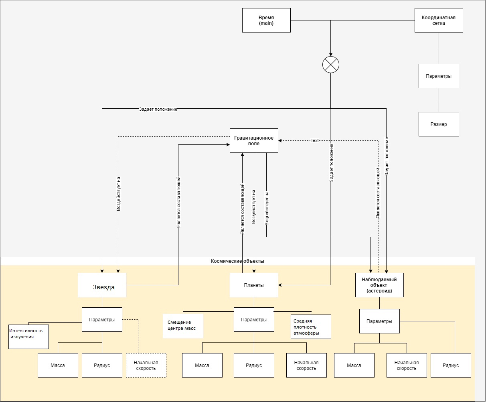
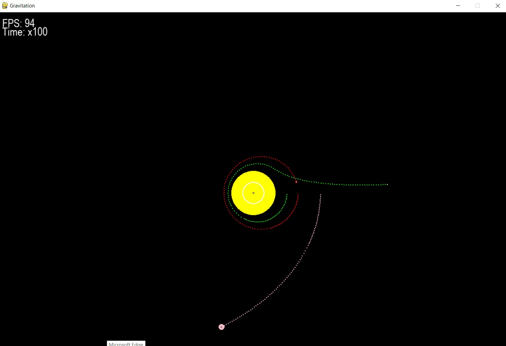
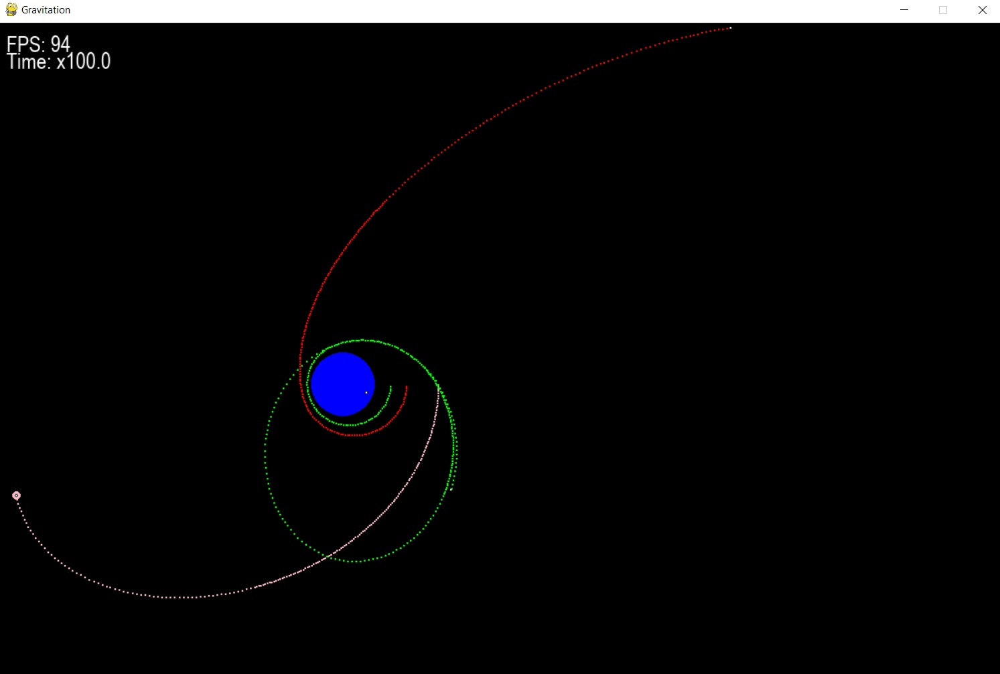
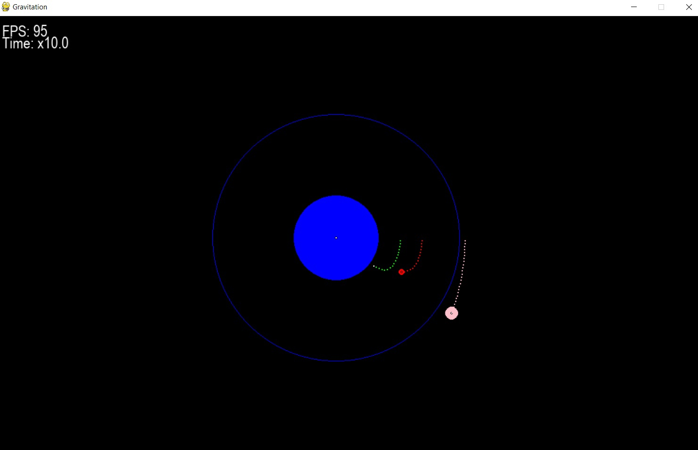

# Отчет по математической модели "Космические тела"

## 1. Состав и функции участников команды

Участник команды  | Функционал
------ | ------ 
Казакова Екатерина| Составление финального отчета по математической модели, администрирование исходного кода в распределенной системе управления версиями, code review     
Корчагин Павел    | Теоретико-физическое описание модели, составление научной документации, участие в программной реализации математической модели
Поддубная Мария   | Составление плана и описание этапов разработки, общая и первичная разработка математической модели, написание сопроводительных документов
Светлаков Алексей | Разработка алгоритма, программная реализация математической модели, участие в  других этапах разработки      

---
## 2. Цели и результаты работы

**Цель работы:** вычислить траектории движения космических тел, определить возможности столкновения косических тел при заданных параметрах, оценить влияния дополнительного космического на орбиты соседних планет и др.

**Результат работы:**
1.   Визуализация движения космических тел с прорисовкой их траектории; 
2.   Список координат центров всех космических тел в двумерном пространстве за определенный промежуток времени (с учетом ускорения времени, в количестве не более 1000 для каждого тела) с погрешностью 1*10^3 м;

---
## 3.Концептуальное описание модели и выбор среды разработки

В качестве объекта моделирование рассматривается космическое пространство на плоскости, в котором двигаются различные тела. Телами могут быть планеты, их естественные или искусственные спутники, Солнце, звезды, астероиды, с учетом взаимодействия сил гравитацици, солнечного ветра и атмосферы.

В небесной механике для описания движений небесных тел в зависимости от конкретных условий используются различные физические модели - идеализированные космические объекты. Например, материальная точка - это тело, обладающее массой и скоростью, размеры, форма и внутреннее строение которого в условиях рассматриваемой задачи существенного значения не имеют. В частности, так как взаимные расстояния между Солнцем и большими планетами значительно превышают их линейные размеры, то приближенно их можно рассматривать как материальные точки.

Положение материальной точки, изображающей конкретный небесный объект, всегда определяется по отношению к некоторому, произвольно выбранному небесному телу, называемому телом отсчета. Совокупность тела отсчета, системы координат и часов (в качестве устройства для отсчета времени) называется системой отсчета, к которой принято относить положение и скорость исследуемого объекта в рассматриваемый момент времени.

Траектория движения небесного тела (орбита) - это геометрическое место его положений на рассматриваемом временном интервале, то есть линия, описываемая материальной точкой в пространстве. 

Таким образом, при выборе среды разработки, прежде всего, исходим из типа решаемой задачи, типов обрабатываемых данных, перспектив роста и масштабирования. Исходя из условиямпоставленной задачи, в качестве языка программирования лучше использовать Python. Основными преимуществами данного языка являются:

1. **Понятность кода.** Синтаксическая особенность Python — выделение блоков кода отступами, что значительно упрощает зрительное восприятие программ, написанных на этом языке.
2. **Интерпретируемость.** Программы, написанные на языке программирования Python, не переводятся в машинный код, а сразу выполняются программой-интерпретатором. Это позволяет запускать код на любой платформе с установленным заранее интерпретатором.

3. **Объектно ориентированность.** Python — это язык, созданный согласно парадигме объектно ориентированного программирования (ООП). В ней основными являются понятия объекта и класса.

4. **Динамическая типизация.** В Python переменные связываются с типом в момент присваивания в них конкретных значений.

При численном моделировании сложных систем возникает ряд проблем, которые требуют сочетания подходов, сложившихся в совершенно разных областях науки. Прежде всего, это касается огромного потенциала вычислительной математики. Таким образом рассмотрим объектно-ориентированный подход в качестве основного принципа в данной работе.

Так объектно-ориентированное программирование (ООП) позволяет использовать один и тот же программный код с разными данными. На основе классов создается множество объектов, у каждого из которых могут быть собственные значения полей. Нет необходимости вводить множество переменных, т.к. объекты получают в свое распоряжение индивидуальные пространства имен. В этом смысле объекты похожи на структуры данных. Объект можно представить в виде некой упаковки данных, к которой присоединены инструменты для их обработки – методы.

---
## 4. Описание структуры

**Координатная сетка** задается неявно с помощью средств библиотеки pygame.

**Звезды, планеты и астероиды** задаются одним и тем же спрайтом Objects с параметрами, а их классификация происходит по вводимому типу во входных данных. Для звезд соответствует тип 1, для планет 2, для астероидов 3.
Все типы принимают одинаковые параметры, но тип влияет на то, какие из них учитываются, а какие нет.

В модели все объекты представлены материальными точками с радиусом (для обработки столкновений и учета высоты атмосферы).

**Гравитация** рассчитывается для каждого вне зависимости от типа объекта.

**Атмосферное сопротивление** рассчитывается с проверкой условия, что тип объекта равен 2, как и смещение центра масс.

**Давление света** (солнечный ветер) рассчитывается только для объектов типа 1.

Отрисовка объектов и их треков, расчет координат в зависимости от сил, рассчитываются внутри спрайта вне зависимости от типа.

**Силы** рассчитываются в цикле вне спрайта для каждого объекта, там же и происходит обработка столкновений каждый кадр.

Структура модели представлена на рисунке ниже:



## 4.1 Обработка событий

* Стрелка вверх - ускоряет время в 10 раз.
* Стрелка вниз - замедляет время в 10 раз.
* Клавиша 1 - включает и выключает атмосферы планет.
* Клавиша 2 - включает/выключает давление света.
* Enter - включает/выключает запись выходных данных в файл.
* Колесико вверх - уменьшает масштаб карты
* Колесико вниз - увеличивает масштаб карты
* Нажатие на колесико - добавляет планету с центром в курсоре с рандомной массой и скоростью.
* ЛКМ - перемещение по карте
* ПКМ - если кнопка нажата на планете, то по курсору происходит смещение центра масс планеты.

---
## 5. Описание входных данных и выходных данных

## 5.1. Входные данные

Система: условно гелиоцентрическая (в базовой реализации), привязана к эфиру.

При инициализации программы изначально 1 млн. м в пикселе, масштаб можно менять со множителем 0.85.
Основные единицы измерения в модели: координаты, радиус - метры, масса - килограммы, время - секунды, скорость - м/с *, ускорение - м/с^2 *, сила - Н.

* Примечание: в модели время, скорость и ускорение рассчитываются с домножением на поправочный коэффициент K=k/FPS, где k - множитель ускорения времени относительно реального (по умолчанию 1), FPS - количество кадров в секунду (по умолчанию 100). Таким образом, внутренне используемые самой моделью единицы измерения: время - кадр, скорость - м/кадр, ускорение - м/кадр^2.

Сетка: [-1000  млн. км; 1000 млн. км];[-1000 млн. км; 1000 млн. км]

Также для удобства визуализации все объекты типа 1-6 имеют в качестве параметра цвет.

Параметр  |  | Тип | Обязательный параметр | Возможное значение параметра | Описание параметра 
------ | ------ | ----- | ------ | ------ | ------
Object | | | | 
Type |  | int | Да | 1, 2 или 3| Тип объекта 
_ | CoordinateX | float | Да | Любое число или выражение | Координата начального положения Солнца по оси абсцисс (м)
_ | CoordinateY | float | Да | Любое число или выражение | Координата начального положения Солнца по оси ординат (м)
_ | Radius | float | Да | Любое число или выражение | Радиус Солнца (м)
_ | Weight | float | Да | Любое число или выражение | Масса Солнца (кг) 
_ | SpeedX | float | Да |Любое число или выражение | Начальная скорость Солнца по оси абсцисс (м/с) 
_ | SpeedY | float | Да | Любое число или выражение | Начальная скорость Солнца по оси ординат (м/с)
_ | Colour | str | Да | red, green, blue... | Цвет отображения в модели 
_ | Name | str | Да | Любая строка | Имя объекта
_ | Intensity | float | Нет | Любое число или выражение | Интенсивность излучения (только для звезд) 
_ | Density | float | Нет | Любое число или выражение | Средняя плотность атмосферы (только для планет)


Таким образом на вход программы подается XML файл следующего вида:
```xml
<?xml version="1.0" encoding="utf-8"?>
<InputData>
  <ObjectList>
    <Object id="1">
     <Type>1</Type>
     <CoordinateX>0</CoordinateX>
     <CoordinateY>0</CoordinateY>
     <Radius>696000000</Radius>
     <Weight>1.9891*10**30</Weight>
     <SpeedX>0</SpeedX>
     <SpeedY>0</SpeedY>
     <Colour>yellow</Colour>
     <Name>Sun</Name>
    </Object>
    <Object id="2">
     <Type>2</Type>
     <CoordinateX>-149.6*10**9</CoordinateX>
     <CoordinateY>1</CoordinateY>
     <Radius>6371000</Radius>
     <Weight>5.9722*10**24</Weight>
     <SpeedX>0</SpeedX>
     <SpeedY>29782.77</SpeedY>
     <Colour>blue</Colour>
     <Name>Earth</Name>
    </Object>
    <Object id="3">
     <Type>3</Type>
     <CoordinateX>-149.6*10**9+123104000</CoordinateX>
     <CoordinateY>149.6*10**9+1231040000</CoordinateY>
     <Radius>463500</Radius>
     <Weight>9.393*10**20</Weight>
     <SpeedX>3000</SpeedX>
     <SpeedY>29782.77</SpeedY>
     <Colour>red</Colour>
     <Name>Asteroid</Name>
    </Object>
    <Object id="4">
     <Type>2</Type>
     <CoordinateX>-149.6*10**9+363104000</CoordinateX>
     <CoordinateY>0</CoordinateY>
     <Radius>1737100</Radius>
     <Weight>7.35*10**22</Weight>
     <SpeedX>0</SpeedX>
     <SpeedY>29782.77+1080</SpeedY>
     <Colour>grey</Colour>
     <Name>Moon</Name>
    </Object>
    <Object id="5">
     <Type>2</Type>
     <CoordinateX>69.6*10**9</CoordinateX>
     <CoordinateY>30*10**9</CoordinateY>
     <Radius>6_371_000</Radius>
     <Weight>5.9722*10**24</Weight>
     <SpeedX>0</SpeedX>
     <SpeedY>27782.77</SpeedY>
     <Colour>brown</Colour>
     <Name>Planet</Name>
    </Object>
    <Object id="6">
     <Type>2</Type>
     <CoordinateX>-778_570_000_000</CoordinateX>
     <CoordinateY>0</CoordinateY>
     <Radius>71492000</Radius>
     <Weight>1.8986*10**27</Weight>
     <SpeedX>0</SpeedX>
     <SpeedY>13070</SpeedY>
     <Colour>orange</Colour>
     <Name>Jupiter</Name>
    </Object>
  </ObjectList>
</InputData>
```

## 5.3. Выходные данные

1. Визуальная часть: окно программы, в котором происходит анимированное перемещение объектов, а также отрисовка траекторий в виде точек, ставящихся с определенной частотой. При инициализации программы время идет с той же скоростью, что и реальное, однако его можно ускорить в 10, 100, 1000, 10000, 100000, 1000000, 10000000 раз. Масштаб карты при инициализации: 1000000 м в пикселе, но его можно менять в 0.85 раз (увеличивать и уменьшать).

2. Техническая часть: в файл записываются координаты (x, y) точек траекторий всех объектов, существующих в модели, в количестве, равном длине массива точек траектории, а также текущее положение объекта. При нажатии кнопки Enter программы файл сохраняет последние записанные значения точек траекторий и положений самих объектов.

На выходе программы получаем файл следующего вида:

```
Earth: 
-149599340408.7121  402605876.1491496
-149597356059.44592  807634153.6228634
-149594047593.1099  1212646848.2785773
-149581718650.8605  2120888601.6938097
-149560555052.36575  3029343998.3157554
-149538733887.53964  3601243270.184607
-149509260953.35156  4172849866.6570415
-149472701484.17557  4738161008.6188345
-149428966442.03906  5303087941.2576685
-149378137494.90973  5867597320.932033
-149320288911.78946  6431659519.367316
-149255492887.8691  6995245445.501517
-149183819577.09763  7558326656.647014
-149092327126.1544  8209648605.428011
-148991807165.20566  8860216727.30906
-148882342485.06317  9510006046.017567
-148763991021.48154  10159000351.673092
-148636793455.55676  10807181975.448498
-148500785285.51306  11454531892.169449
-148355999184.37402  12101031658.057928
-148202466006.38223  12746662241.490849
-148040215453.2025  13391403686.0594
-147869277595.5424  14035236425.989609
-147689682542.87988  14678141242.018515
-147501434746.53262  15320095100.011864
-147304517951.98257  15961073547.967531
-147098958853.90875  16601066710.342327
-146884775211.74304  17240081055.99792
-146661963971.72302  17878142535.3636
-146430513960.37836  18515275723.24477
-146190385366.90787  19151496618.41005
-145941563469.3707  19786827542.814598
-145684044335.0738  20421292635.090813
-145430118430.6986  21026131759.97323
-145168280826.78577  21630217647.95091
-144898430409.24945  22233538323.417133
-144620432008.66635  22836070123.951828
-144334325429.85025  23437802156.750008
-144040150926.8142  24038723106.605774
-143737948099.987  24638820972.27887
-143427756005.1428  25238083164.687737
-143109577998.15594  25836485548.53301
-142782406358.9671  26433688023.143032
-142445802040.9841  27029537558.55898
-141897900042.4761  27963139899.78544
-141326978790.76392  28893401447.712296
-140751523509.66537  29792278813.429096
-140154702364.65884  30688002063.48915
-139536605707.2023  31580549786.100796
-138795378082.71716  32608506971.177635
-138025483069.86575  33631962266.015408
-137248744450.41278  34623196519.89091
-136443017083.12268  35609352717.34186
-135605769215.96124  36589594711.30997
-134761698029.59793  37536460885.59567
-133888184481.33014  38476950660.50531
-133011222379.22824  39384142398.09554
-132106389553.19797  40284720789.24679
-131173930578.18082  41178424545.68716
-130242677015.31465  42039019257.802475
-129285743468.29732  42892644258.807556
-128333385133.04198  43713514403.60053
-127357124590.1712  44527381170.93441
-126357110929.27806  45334026360.52951
-125365803493.49605  46108371668.6086
-124352415674.83504  46875552273.142265
-123317040832.13414  47635387139.19099
```
---
## 6. Теоретическая справка

## 6.1. Координатная сетка

Покрывает всё двухмерное пространство. Размер координатной сетки: *2000* млн. км х *2000* млн. км
Центральные координаты (0;0), единичный отрезок 1 м., погрешность расчетов координат 1 км. Координатная сетка в модели - условно гелиоцентрическая, в общем случаи привязана к эфиру. Объекты вылетающие за пределы координатной сетки "уничтожаются". 

Координатная сетка необходима для расчета координат всех объектов участвующих в модели. КС не влияет на движение инных объектов: законы относительности Эйнштейна в модели не учитываются (время во всех точках КС  равномерно). 

## 6.2. Астероид

**Астероид** - относительно небольшое небесное тело планетарной системы, движущееся по орбите вокруг звезды. Астероиды значительно уступают по массе и размерам планетам, имеют неправильную форму и не имеют атмосферы, хотя при этом и у них могут быть спутники. Входят в категорию малых тел планетарной системы.

В моделе астероиды представлены материальными точками с очень малыми радиусами и массами. Радиус астероида необходим для обработки столкновений. Масса астероида используется в расчете гравитационных сил дествющих на астероид от других объектов. 

Сила от каждого объекта рассчитывается по закону всемирного тяготения: 

$$ F=G\frac{m_1m_2}{r^2},$$

где: 

$G$-гравитационная постоянная;

$m_{1}$ - масса рассматраиваемого объекта; 

$m_{2}$ - масса второго объекта;

$r$ - расстояние между объектами.

Результирующая сила рассчитывается как равнодействующая всех сил действующих на астероид.

## 6.3. Планета

**Планета** - небесное тело, вращающееся по орбите вокруг звезды, достаточно массивное, чтобы стать округлым под действием собственной гравитации, но недостаточно массивное для начала термоядерной реакции.

**Экзопланета** или внесолнечная планета, — планета, находящаяся вне Солнечной системы.

В моделе планеты представлены материальными точками с радиусами и массами значительно большими по сравнению с радиусами и массами астероидов. Радиус планеты необходим для обработки столкновений. Масса планеты используется в расчете гравитационных сил дествющих на планету со стороны других объектов. 

Сила от каждого объекта рассчитывается по закону всемирного тяготения: 

$$ F=G\frac{m_1m_2}{r^2},$$

где: 

$G$-гравитационная постоянная;

$m_{1}$ - масса рассматраиваемого объекта; 

$m_{2}$ - масса второго объекта; 

$r$ - расстояние между объектами.

Результирующая сила рассчитывается как равнодействующая всех сил действующих на планету.

В отличии от астероидов планеты могут иметь атмосферу, которая влияет на движение объектов поблизости от неё.

**Атмосфера** - газовая оболочка небесного тела, удерживаемая около него гравитацией. Поскольку не существует резкой границы между атмосферой и межпланетным пространством, то обычно атмосферой принято считать область вокруг небесного тела, в которой газовая среда вращается вместе с ним как единое целое.

**Сила сопротивления** - сила, возникающая при движении тела в газе и препятствующая движению.

$$ F_{sopr}=C_x\frac{\rho v^2}{2}S_x,$$

где: 

$\rho$ — плотность атмосферы на орбите, которая сильно зависит от высоты полета объекта, в данной модели задается пользователем.

$S_x$ — площадь поперечного сечения спутника, точнее — площадь максимального сечения спутника плоскостью, перпендикулярной вектору скорости  $v$  полета спутника относительно среды (или, как говорят, площадь миделя); 

$C_x$ — так называемый коэффициент лобового сопротивления, зависящий, вообще говоря, от скорости, но для реальных условий полета спутника на большой высоте его можно считать примерно равным 2. 
Последнее просто означает, что соударения молекул и атомов с обшивкой спутника неупругие, в результате чего спутнику в единицу времени передается импульс, равный ρυ2 на единицу площади поперечного сечения.


В расширенной моделесила сопротивления расчитывается по выше указанной формуле, она направлена против движения объекта. Сила сопротивления вычитается из равнодействующей силы покоординатно.

**Центр массы тела (центр инерции тела)** - абстрактная точка, положение которой определяется распределением масс в теле. Условно считается, что в этой точке сосредоточена вся масса тела.

У планет земного типа *центр масс* может находиться не в геометрическом центре планеты.

## 6.4. Звезда

**Звезда** - массивное самосветящееся небесное тело, состоящее из газа и плазмы, в котором происходят, происходили или будут происходить термоядерные реакции. Звёзды различаются структурой и химическим составом, а такие параметры, как радиус, масса и светимость, у разных звёзд могут отличаться на порядки.

**Классы звёзд**: 

* I — сверхгиганты;
* II — яркие гиганты;
* III — гиганты;
* IV — субгиганты;
* V — звёзды главной последовательности, иногда «карлики»;
* VI — субкарлики;
* VII — белые карлики.

В модели рассматриваются солнцеподобные звёзды ("жёлтые карлики"). Звезды представлены  материальными точками с радиусами и массами значительно большими по сравнению с радиусами и массами планет. Радиус звезды необходим для обработки столкновений. Масса звезды используется в расчете гравитационных сил дествющих на звезду со стороны других объектов. 

Сила от каждого объекта рассчитывается по закону всемирного тяготения: 

$$ F=G\frac{m_1m_2}{r^2},$$

где: 

$G$-гравитационная постоянная;

$m_{1}$ - масса рассматраиваемого объекта; 

$m_{2}$ - масса второго объекта; 

$r$ - расстояние между объектами.

Результирующая сила рассчитывается как равнодействующая всех сил действующих на звезду. 

**Давления света** - давление, которое оказывает световое (и вообще электромагнитное) излучение, падающее на поверхность тела.

$$p={\frac {I}{c}}(1-k+\rho ),$$

где: 

$I$ - интенсивность падающего излучения; 

$c$ - скорость света;

$k$ - коэффициент пропускания; 

$\rho$  — коэффициент отражения.

Сила давления расчитывается по формуле:

$$F=pS$$

**Солнечный ветер** - поток ионизированных частиц (в основном гелиево-водородной плазмы), истекающий из солнечной короны со скоростью 300—1200 км/с в окружающее космическое пространство. Является одним из основных компонентов межпланетной среды.

**Сила солнечного ветра**

$$F=\frac{\Delta{p}}{\Delta{t}},$$

где: 

$\Delta{p}$ -имплуьс протонов прилетающих на площадку единичной площади.

$$\Delta{p}=\mu v_pm_p$$

$\mu$ - средняя концетрация протонов;

$v_p$ - средняя скорость протона (470 км\с);

$m_p$ - масса протона (1.67E-27 кг).

В отличии от планет звезда однородна, поэтому центр масс находится в геометрическом центре. Все остальные возможные факторы не учитываются в модели. 

## 6.5 Дополнительный формулы

Расчет ускорения результирующей силы осуществляется по  2 закону Ньютона:

$$\overrightarrow{a}=\frac{{\overrightarrow{F}}}{m},$$

где:

$m$ - масса тела

$\overrightarrow{F}$ - вектор результирующей силы

Абсолютно неупругий удар характеризуется тем, что после удара тела движутся с одинаковой скоростью либо покоятся, кинетическая энергия полностью или частично превращается во внутреннюю энергию.
Скорость тел после удара рассчитывается по формуле: 

$$\overrightarrow{v}=\frac{m_{1}\cdot \overrightarrow{v_{10}}+m_{2}\cdot \overrightarrow{v_{20}}}{m_{1}+m_{2}}$$

где $m_{1} m_{2}$ - массы объектов 
$\overrightarrow{v_{10}}  \overrightarrow{v_{20}}$ - скорости тел до столкновения.

Расчет длины вектора скорости а также расстояние между центрами объектов рассчитывается по теореме Пифагора:
$c=\sqrt{a^{2}+b^{2}}$, где a - проекция вектора $\overrightarrow{с}$ на Оx, b - на Оу.

Среднее арифместическое взвешенное: 

$\overline{x}=\frac{x_{1}\cdot m_{1}+x_{2}\cdot m_{2}}{m_{1}+m_{2}}$

Расчет радиуса нового объекта при сохрании условия $V=V_{1}+V_{2}$, где V - объем:
$R=\sqrt[3]{r_{1}^{3}+r_{2}^{3}}$

---
## 7. Допущения математической модели

* Звезд, планет и астероидов может быть несколько
* В реализации модели столкновение просчитывается с помощью модели абсолютно неупругого удара с уничтожением меньшего объекта
* Начальные координаты всех объектов не должны выходить на границу сетки;
* Если в процессе работы модели объект выходит за границу сетки, то он уничтожается
* Массы и размеры планет должны быть пренебрежимо малы в сравнении с массой звезды
* Масса и размеры астероида должна быть пренебрежимо мала в сравнении с массами планет и звезд
* Недопустимы высокие значения скоростей (>500000 м/с), в противном случае скорость будет принудительно ограничиваться
* В реализации модели учитывается гравитационное взаимодействие (основа), смещение центра масс у планет, сопротивление атмосферы, давление света от звезд, не учитывается солнечный ветер и прочие возможные не перечисленные незначительные факторы
* В реализации модели не учитывается только солнечный ветер, так как его влияние на порядки меньше влияния давления света, что делает его бессмысленным с точки зрения включения в модель
---
## 8. Алгоритмы

## 8.1. Задача расчета координат с учетом сил гравитации

Задача сводится к расчету координат каждого из космических тел в каждый момент времени по следующему алгоритму:

Берется бесконечный цикл while с частотой обновления ~100 кадр/с:
1. Берется цикл по всем объектам (i);
2. Берется цикл по всем объектам (j), начиная с i+1.
3. Находятся проекции расстояния от центра i до центра j на оси x и y
4. По теореме Пифагора находится расстояние от центра i до центра j
5. По закону всемирного тяготения находится сила гравитационного взаимодействия между объектами i и j
6. Находится проекция силы для каждого объекта на обе оси с помощью отношения сторон подобных треугольников. Она складывается для объекта i и вычитается для объекта j со значением силы, полученной для предыдущих объектов (находится равнодействующая для каждого объекта), если предыдущей итерации не было, значения сил равны 0.
7. Цикл по i и j закончен
8. Берется цикл по всем объектам, вызывается функция обновления внутри спрайта объектов 
    1. По закону Ньютона рассчитываются проекции ускорений, домноженные на поправочный коэффициент времени
     
     2. Предыдущее значение скорости корректируется на найденное ускорение, находится новая скорость (предыдущая скорость должна быть скорректирована на поправочный коэффициент)
    
     3. Предыдущее значение кооординат корректируется на найденную скорость, находятся новые координаты
9. Для каждого объекта значение силы обнуляется в конце каждого кадра
  
## 8.2. Задача прорисовки траектории
 
Берется бесконечный цикл while с частотой обновления ~100 кадр/с:
1. Решается задача нахождения новых координат
2. В процессе работы функции обновления внутри спрайта к значению count прибавляется длина вектора скорости
3. Как только count превысит некоторое фиксированное значение (значение частоты точек траектории), брасываем count и добавляем найденные координаты планеты в массив траектории (при необходимости массив можно вывести в файл)
5. Если массив превышает фиксированную длинну, удаляем последнее значение (организация данных по типу очередь)
6. Функция обновления заканчивает работу
7. Отрисовываем массив точек траектории вместе с самим объектом
   
 
## 8.3. Задача обработки столкновений
 
Берется бесконечный цикл while с частотой обновления ~100 кадр/с:
1. После 6 этапа задача расчета координат, проверяем, нет ли объектов в состоянии коллизии, если есть, добавляем их в массив
2. Цикл по i и j закончен
3. Для объектов в коллизии уничтожаем их оба
4. Создаем новый объект того же типа и цвета, что был большим по радиусу, координаты нового объекта - среднее арифметическое взвешенное координат объектов коллизии (в качестве весов - масса)
5. Рассчитываем новый радиус так, что сумма объемов объектов коллизии была равна объему созданного объекта, вычисляем массу как сумму масс объектов коллизии
6. Вычисляем новую скорость объекта по формуле абсолютно неупругого удара
7. Обновляем массив существующих объектов


## 8.4. Задача расчета координат с учетом изменения центра масс

При запуске программы центр масс находится в геометрическом центре планеты. Нажатием правой кнопкой мыши по планете можно его изменить на произвольный.

1. При нажатии на кнопку в разделе обработки событий проверям, находится ли положение курсора внутри планеты (по реальным координатам).
2. Если это условие выполняется, то вычисляем смещение положения курсора от геометрического центра по х и по у отдельно.
3. Далее решается задача расчета координат с учетом сил гравитации с учетом того, что рассматриваются не центры объектов i и j, а их центры с поправкой на рассчитанное смещение.
4. Сам объект отрисовывается внутри спрайта с поправкой на рассчитанное смещение, а также отрисовывается центр масс.


## 8.5. Задача расчета координат с учетом давления света звезды (солнечного ветра)

При запуске программы давление света (солнечный ветер) отключен. Его можно включить нажатием клавиши "2". 
Интенсивность излучения звезды задается по умолчанию.

1. Когда давление света включено, рассчитываем по формуле силу давления света от источников-звезд (без проекций).
2. Перед 5, в задаче рассчета координат по гравитации находятся проекции расчитанной силы с помощью соотношения сторон подобных треугольников только для тех объектов, которые не являются источниками.
3. Проекции силы берутся с противоположным знаком по сравнению с силой гравитации.
4. Суммарная сила корректируется на найденные проекции. 
5. Повторяем шаги 2, 3, 4 изменив индексы у объектов на противоположные (это необходимо, поскольку цикл пробегает по всем объектам один раз в определенном порядке).
6. Далее решается задача расчета координат по гравитации.

## 8.5. Задача расчета сопротивления атмосферы.

При запуске программы атмосфера выключена. Ее можно включить нажатием клавиши "1" на клавиатуре. 

Плотность атмосферы и ее максимальная высота задаются в среднем по умолчанию.

1. Когда атмосфера планет включена, проверяем, не находится ли какой-то объект в пределах атмосферы планеты.
2. Если ответ положительный, то (перед 5 в задаче расчета координат по гравитации) по формуле рассчитываем силу сопротивления атмосферы отдельно по каждой оси.
3. Ставим знак силы, противоположный к знаку проекции скорости по этой же оси. Причем, если значение новой рассчитаной скорости по силе сопротивления будет превышать начальную скорость, то обнуляем значение скорости у объекта и пропускаем шаг 4.
4. Корректируем ранее найденную силу (из остальных задач) на значение силы сопротивления.
5. Повторяем шаги 3-4 для другой оси.
6. Повторяем шаги 2-5 с измененным индексами на противоположные (это необходимо, поскольку цикл пробегает по всем объектам один раз в определенном порядке).
7. Далее решается задача расчета координат по гравитации.

## 9. Программная реализация алгоритма

```python
import pygame
import time
import xml.etree.ElementTree as ET
import numexpr as ne
import random as rn

WIDTH = 1200  #ширина окна
HEIGHT = 800  #высота окна
FPS = 100 #частота обновления, кадры в секунду
G = 6.67430/(10**(11)) #гравитационная постоянная 
k = 1_000_000 #метров в пикселе на момент инициализации, масштаб 

w_x = -600_000_000 #координаты угла окна 
w_y = -400_000_000 #на общей карте
atm = 0  #включение и выключение атмосферы
wind = 0 #включение и выключение давления солнечного света
entry=0 #запись в файл

vrem_k = 1 # коэффициент ускорения времени на начало, 1 - реальное время, 

pygame.init()

screen = pygame.display.set_mode((WIDTH, HEIGHT)) #инициализация окна
pygame.display.set_caption("Gravitation") #название программы
clock = pygame.time.Clock()
font = pygame.font.SysFont('arial', 26) #шрифт и размер
text_FPS = font.render('FPS: '+str(FPS), True,'white') #запись частоты обновления на экране
text_vrem_k = font.render('Time: x'+str(vrem_k), True,'white') #запись ускорения времени на экране
                
class Objects(): #спрайт всех объектов
    def __init__(self,types,real_x,real_y,real_r,m,colour):
        self.types = types; #тип ксомического объекта: звезда = 1, планета = 2 или астероид = 3
        self.real_x = real_x #x координата геометрического центра объекта, м
        self.real_y = real_y #у координата геометрического центра объекта, м
        self.real_r = real_r #радиус, м
        self.m = m #масса, кг
        self.colour = colour #цвет
        self.speed = [0,0] #вектор скорости, м/с
        self.a = [0,0] #вектор ускорения, м/с**2
        self.f = [0,0] #вектор силы гравитационного поля,Н
        self.trace_count = 0 #расчет трека, расстояние между точками
        self.trace = [] #массив точек трека
        self.status = True #статус существования
        self.name = ''  #имя объекта для удобства для записи в файл

        self.s_x = 0 #смещение центра масс по х для планет
        self.s_y = 0 #смещение центра масс по y для планет
        self.I = 0 #интенстивность излучления звезды
        self.po = 1*10**(-13) #средняя плотность атмосферы

    def update(self): #расчет характеристик тел в каждый момент времени
        self.a[0] = ((self.f[0]/self.m)*(vrem_k**2)/FPS**2) #расчет ускорения по 2 закону Ньютона a=F/m
        self.a[1] = ((self.f[1]/self.m)*(vrem_k**2)/FPS**2) #домноженный на поправочный коэффициент

        self.speed[0] +=  self.a[0] #расчет скорости
        self.speed[1] +=  self.a[1] 

        while (self.speed[0]>500_000*(vrem_k/FPS) or self.speed[1]>500_000*(vrem_k/FPS) or self.speed[0]<-500_000*(vrem_k/FPS) or self.speed[1]<-500_000*(vrem_k/FPS)):
            self.speed[0]/=2;
            self.speed[1]/=2;#принудительное ограничение скорости
     
        self.real_x += self.speed[0] #расчет координаты
        self.real_y += self.speed[1]


        if self.real_x>1000_000_000_000 or self.real_x<-1000_000_000_000 or self.real_y>1000_000_000_000 or self.real_y<-1000_000_000_000:
            self.status =False #уничтожаем объект при вылете за границу карты

        # траектория:
        self.trace_count += (self.speed[0]**2+self.speed[1]**2)**0.5 #каждый раз добавляется длина вектора скорости
        if self.trace_count/k >= 5: #частота появления точек трека
            self.trace_count = 0
            self.trace.append((self.real_x,
                                self.real_y))
        if len(self.trace)>1000: #регулировка длины трека: если массив точек в треке превысит 1000,
            self.trace.pop(0)   #удаляем последний 
            
    def draw(self): #отрисовка
        pygame.draw.circle(screen,
                           self.colour,
                           ((self.real_x - w_x)/k, #вычисление координат места на карте для рисования
                            (self.real_y - w_y)/k),
                           self.real_r/k
                           ) #отрисовка самого объекта по геометрическому центру
     
        pygame.draw.circle(screen,
                           'black',
                           ((self.real_x - w_x + self.s_x)/k, 
                            (self.real_y - w_y + self.s_y)/k),
                           2
                           ) 
        pygame.draw.circle(screen,
                           'white',
                           ((self.real_x - w_x + self.s_x)/k, 
                            (self.real_y - w_y + self.s_y)/k),
                           1
                           ) #отрисовка центра масс (предназначено для планет)

        if atm==1 and self.types==2:
            pygame.draw.circle(screen,
                           self.colour,
                           ((self.real_x - w_x)/k, #вычисление координат места на карте для рисования
                            (self.real_y - w_y)/k),
                           (self.real_r+12000_000)/k,
                           1
                           ) #отрисовка контура атмосферы

        if wind==1 and self.types==1:
            pygame.draw.circle(screen,
                           'white',
                           ((self.real_x - w_x)/k, #вычисление координат места на карте для рисования
                            (self.real_y - w_y)/k),
                           (self.real_r-self.real_r/2)/k,
                           2
                           ) #отрисовка окружности (давление света)

        for i in self.trace:
            pygame.draw.circle(screen,
                           self.colour,
                           ((i[0] - w_x)/k,
                                (i[1] - w_y)/k),
                            1) #отрисовка трека по геометрическому центру

objects = []   #Объектов на карте 

#считывание с файла
tree = ET.parse("data2.xml")
Ob=tree.findall('ObjectList/Object')
#Считывание с xml-файла данных с автоматическим вычислением и преобразованием в нужный тип данных
for i in range(len(Ob)):
    p = Objects(int(Ob[i].find('Type').text),#считываем тип объекта
                float(ne.evaluate(Ob[i].find('CoordinateX').text)), #координата центра по х
                float(ne.evaluate(Ob[i].find('CoordinateY').text)), #координата центра по y
                float(ne.evaluate(Ob[i].find('Radius').text)), #радиус объекта
                float(ne.evaluate(Ob[i].find('Weight').text)), #вес
                Ob[i].find('Colour').text) #цвет
    objects.append(p)
    objects[i].speed[0]+=float(ne.evaluate(Ob[i].find('SpeedX').text))*(vrem_k/FPS) #скорость по х
    objects[i].speed[1]+= float(ne.evaluate(Ob[i].find('SpeedY').text))*(vrem_k/FPS) #скорость по y
    objects[i].name = Ob[i].find('Name').text; #имя объекта
    try:
        objects[i].I = float(ne.evaluate(Ob[i].find('Intensity').text)) #интенсивность излучения
    except BaseException: objects[i].I=0 #если объекты не соответствующего типа, то эти данные не используются
    try:
        objects[i].po = float(ne.evaluate(Ob[i].find('Density').text)) #средняя плотность атмосферы
    except BaseException: objects[i].po=0 #если объекты не соответствующего типа, то эти данные не используются

    #objects[i].speed[0]+=Ob[i].find('SpeedX').text*(vrem_k/FPS)
    #objects[i].speed[1]+= Ob[i].find('SpeedY').text*(vrem_k/FPS)

    #print(Ob[i].find('Type').text)

#Солнце

#p = Objects(1,0,0,696_000_000,1.9891*10**30,'yellow')
#objects.append(p)

#Земля:
#p = Objects(2,-149.6*10**9,0,6371000,5.9722*10**24,'blue')
#objects.append(p)
#objects[1].speed[1]+= 29782.77*(vrem_k/FPS)

#Луна:
#p = Objects(2,-149.6*10**9+363104000,0,1737100,7.35*10**22,'grey')
#objects.append(p)
#p.speed[1] = 1080*(vrem_k/FPS)
#objects[2].speed[1]+= 29782.77*(vrem_k/FPS)

#Планета, которая вращается по эллиптической орбите
#p = Objects(3,69.6*10**9,30*10**9,6_371_000,5.9722*10**24,'brown')
#objects.append(p)
#objects[3].speed[1]+= 27782.77*(vrem_k/FPS)

#Юпитер
#p=Objects(2, -778_570_000_000,0,71492000,1.8986*10**27,'orange')
#objects.append(p)
#objects[4].speed[1]+= 13070*(vrem_k/FPS)

#Астероид 
#p=Objects(3, -149.6*10**9+123104000,149.6*10**9+1231040000, 463500, 9.393*10**20,'green')
#objects.append(p)
#objects[5].speed[0]+=3000*(vrem_k/FPS)
#objects[5].speed[1]+= 29782.77*(vrem_k/FPS)

tick = 0
tm = time.time()
running = True
while running:
    
    clock.tick(FPS) #устанавливаем желательную и максимальную задержку между циклами (не более 100 кадров в секунду)
    tick+=1
    if tick == 100:
        tick = 0
        text_FPS = font.render('FPS: '+str(int((100/(time.time() - tm)))), True,
                  'white') #вычисляем и пишем реальную задержку времени
        
        tm = time.time()
        
    #обработка событий
    for event in pygame.event.get():
        if event.type == pygame.QUIT: #выход из программы
            running = False

        if event.type == pygame.KEYDOWN:
            if pygame.key.get_pressed()[pygame.K_1]:#включаем и выключаем отображение атмосферы
                if(atm==0):
                    atm=1
                else:
                    atm=0

            if pygame.key.get_pressed()[pygame.K_2]:#включаем и выключаем давление света
                if(wind==0):
                    wind=1
                else:
                    wind=0

            if pygame.key.get_pressed()[pygame.K_RETURN]:#включаем и выключаем запись в файл
                if(entry==0):
                    entry=1
                else:
                    entry=0

            if pygame.key.get_pressed()[pygame.K_UP]:  #изменяем ускорение времени 
                    vrem_k *= 10 #увеличение в 10 раз 
                    for i in objects:
                        i.speed[0]*=10
                        i.speed[1]*=10
                    text_vrem_k = font.render('Time: x'+str(vrem_k), True,'white') #пишем множитель времени
            if pygame.key.get_pressed()[pygame.K_DOWN]:  #изменяем ускорение времени 
                    vrem_k /= 10 #уменьшение в 10 раз 
                    for i in objects:
                        i.speed[0]/=10
                        i.speed[1]/=10
                    text_vrem_k = font.render('Time: x'+str(vrem_k), True,'white') #пишем множитель времени
                
        if event.type == pygame.MOUSEBUTTONDOWN:
            #Найдём место на реальной карте,
            #куда хочет попасть пользователь:
            xx = event.pos[0] #положение курсора по х в окне 
            yy = event.pos[1] #положение курсора по y в окне
            jump_x = w_x + xx*k #положение курсора по х на реальной карте
            jump_y = w_y + yy*k  #положение курсора по y на реальной карте

            if event.button == 3:#задаем вручную центр масс
                for ball in objects:
                    if ((jump_x-ball.real_x)**2+(jump_y-ball.real_y)**2)**0.5<ball.real_r and ball.types==2:#если курсор попадает в планету
                       ball.s_x =  jump_x-ball.real_x #вычисляем смещение центра по x и по y
                       ball.s_y =  jump_y-ball.real_y
          
            if event.button == 4:  #уменьшение масштаба (приближение)
               if k>100_000:
                    k = k*0.85


               w_x = jump_x - xx*k #обновляем положение угла окна на реальной карте
               w_y = jump_y - yy*k

            if event.button == 2:

                #добавление рандомной планеты
                q=Objects(2,jump_x,jump_y,rn.uniform(100000, 5000000),rn.uniform(1, 5)*10**rn.randint(26, 27),
                          rn.choice(['purple','red','yellow','green','blue']))
                objects.append(q)
                q.speed[0] = rn.uniform(-120000, 120000)*(vrem_k/FPS)
                q.speed[1] = rn.uniform(-120000, 120000)*(vrem_k/FPS)
                q.name = 'Planet'+str(rn.randint(10, 1000))
                
            if event.button == 5:  #увеличение масштаба (отдаление)
               if k<100_000_000_0:
                    k = k/0.85

               w_x = jump_x - xx*k
               w_y = jump_y - yy*k
                 
        if event.type == pygame.MOUSEMOTION: #перемещение карты
            if pygame.mouse.get_pressed()[0] == True:
                w_x -= event.rel[0]*k #обновляем положение угла окна на реальной карте 
                w_y -= event.rel[1]*k #по относительному смещению положения курсора
            
    collisions = [] #массив индексов объектов, которые вошли в коллизию

    #считаем действующие силы на каждое тело
    for i in range(len(objects)): #цикл по длине массива объектов
        for j in range(i+1,len(objects)): #выбираем второй объект, не совпадающий с первым
            dx = (objects[j].real_x+objects[j].s_x)-(objects[i].real_x+objects[i].s_x) #проекция расстояния между двумя объектами (центрами масс) по x
            dy = (objects[j].real_y+objects[j].s_y)-(objects[i].real_y+objects[i].s_y) #проекция расстояния между двумя объектами (центрами масс) по y
            d = (dx**2+dy**2)**0.5 #действительное расстояние
            ff = G*objects[i].m*objects[j].m/d**2 #закон всемирного тяготения
            
            #расчет давления света (солнечного ветра)
            if wind==1 and objects[j].types==1:
                fw = objects[j].I/299_792_458*(1-0.1+0.9)*2*3.141592*objects[i].real_r #расчет силы давления света, действующего на объект
                if objects[i].types!=1:
                    objects[i].f[0] -= dx*fw/d #коррекция сил на силу давления света
                    objects[i].f[1] -= dy*fw/d

            if wind==1 and objects[i].types==1:#дубликат с инверсными индексами, нужен для учета порядка взятия объектов
                fw = objects[i].I/299_792_458*(1-0.1+0.9)*2*3.141592*objects[j].real_r #расчет силы давления света, действующего на объект
                if objects[j].types!=1:
                    objects[j].f[0] += dx*fw/d #коррекция сил на силу давления света
                    objects[j].f[1] += dy*fw/d

                       #расчет сил лобового сопротивления атмосферы
            if atm == 1 and objects[i].real_r+12000_000 > d - objects[j].real_r and objects[i].types ==2:
                fs_x = 2/2*objects[i].po*objects[j].speed[0]**2*(3.1415926*objects[j].real_r**2) #вычисление лобового сопротивления по координатам
                fs_y = 2/2*objects[i].po*objects[j].speed[1]**2*(3.1415926*objects[j].real_r**2)

                if objects[j].speed[0]>0: 
                    if  objects[j].speed[0]-fs_x/objects[j].m > 0: objects[j].f[0]-=fs_x  #направляем силу сопротивления противоположно скорости по х
                    else: objects[j].speed[0]=0 #если сопротивление превысило скорость
                else: 
                    if objects[j].speed[0]+fs_x/objects[j].m<0: objects[j].f[0]+=fs_x  #направляем силу сопротивления противоположно скорости по х
                    else: objects[j].speed[0]=0 #если сопротивление превысило скорость

                if objects[j].speed[1]>0: 
                    if  objects[j].speed[1]-fs_y/objects[j].m > 0: objects[j].f[1]-=fs_y
                    else: objects[j].speed[1]=0 #если сопротивление превысило скорость
                else: 
                    if objects[j].speed[1]+fs_y/objects[j].m<0: objects[j].f[1]+=fs_y #направляем силу сопротивления противоположно скорости по y
                    else: objects[j].speed[1]=0

            if atm == 1 and objects[j].real_r+12000_000 > d - objects[i].real_r and objects[j].types ==2: #дубликат с инверсными индексами
                fs_x = 2/2*objects[j].po*objects[i].speed[0]**2*(3.1415926*objects[i].real_r**2) #вычисление лобового сопротивления по координатам
                fs_y = 2/2*objects[j].po*objects[i].speed[1]**2*(3.1415926*objects[i].real_r**2)

                if objects[i].speed[0]>0: 
                    if  objects[i].speed[0]-fs_x/objects[i].m > 0: objects[i].f[0]-=fs_x  #направляем силу сопротивления противоположно скорости по х
                    else: objects[i].speed[0]=0 #если сопротивление превысило скорость
                else: 
                    if objects[i].speed[0]+fs_x/objects[i].m<0: objects[i].f[0]+=fs_x  #направляем силу сопротивления противоположно скорости по х
                    else: objects[i].speed[0]=0 #если сопротивление превысило скорость

                if objects[i].speed[1]>0: 
                    if  objects[i].speed[1]-fs_y/objects[i].m > 0: objects[i].f[1]-=fs_y
                    else: objects[i].speed[1]=0 #если сопротивление превысило скорость
                else: 
                    if objects[i].speed[1]+fs_y/objects[i].m<0: objects[i].f[1]+=fs_y #направляем силу сопротивления противоположно скорости по y
                    else: objects[i].speed[1]=0

            objects[i].f[0] += dx*ff/d #проекция силы гравитации на х для первого объекта
            objects[i].f[1] += dy*ff/d #проекция силы на y для первого объекта

            objects[j].f[0] -= dx*ff/d #проекция силы на х для второго объекта
            objects[j].f[1] -= dy*ff/d #проекция силы на y для второго объекта

            if objects[i].real_r > d - objects[j].real_r: #проверка, не столкнулись ли объекты
                collisions.append((i,j))
                
    #обработаем столкновения:
    for i in collisions:
        t1 = objects[i[0]]
        t2 = objects[i[1]]
        if t1.status and t2.status:
            t1.status = False #уничтожаем объекты
            t2.status = False
            if t1.real_r > t2.real_r: #устанавливаем тип,цвет и имя большего объекта
                c = t1.colour
                tp = t1.types
                nm = t1.name
            else:
                c = t2.colour
                tp = t2.types
                nm = t2.name
                
            t = Objects(tp,(t1.real_x*t1.m+t2.real_x*t2.m)/(t1.m+t2.m), #новые координаты по 
                            (t1.real_y*t1.m+t2.real_y*t2.m)/(t1.m+t2.m), #среднему арифметическому взвешенному
                            (t1.real_r**3+t2.real_r**3)**(1/3), #увеличиваем радиус
                            t1.m + t2.m, #складываем массу
                            c)
            t.speed[0] = (t1.m*t1.speed[0]+t2.m*t2.speed[0])/(t1.m+t2.m) #скорости после абсолютно неупругого удара по х
            t.speed[1] = (t1.m*t1.speed[1]+t2.m*t2.speed[1])/(t1.m+t2.m) #скорости после абсолютно неупругого удара по y
            t.name = nm;
            objects.append(t)
    
    tt = [] #добавляем в массив только те объекты, которые существуют
    for ball in objects: 
        if ball.status:
            tt.append(ball)
    objects = tt #обновляем изначальный массив объектов (выкидывая несуществующие)
            
    for ball in objects:
        ball.update()
        ball.f = [0,0] #обновляем и сбрасываем силу

    #рисуем
    screen.fill('black')
    
    for ball in objects:
        ball.draw()
        
    screen.blit(text_FPS, (10, 10)) #положение фпс на экране
    screen.blit(text_vrem_k, (10, 30)) #положение множителя времени
    if entry==1:
        screen.blit(font.render('Rec', True,'red'), (150, 10)) #уведомление о записи в файл
    pygame.display.update()

    if entry==1:
    #записываем в файл весь массив траектории, если ее еще нет, то текущие координаты.
        f = open('Coords.txt', 'w') #открываем файл на запись 
        for ball in objects:
            f.write(" \n" + ball.name + ": \n")
            if len(ball.trace)>0:
                for i in range(len(ball.trace)):
                  f.write(str(ball.trace[i][0]) + "  "+ str(ball.trace[i][1]) + "\n")
            else:
                f.write(str(ball.real_x) + "  "+ str(ball.real_y) + "\n")
        f.close()#закрываем файл записи

pygame.quit()

```

## 10. Результат работы программы

Демонстрацией работы программы с учетом солнечного ветра:



Пример работы программы с учетом изменения центра масс:


Пример работы программы с реализацией атмосферного сопротивления:
